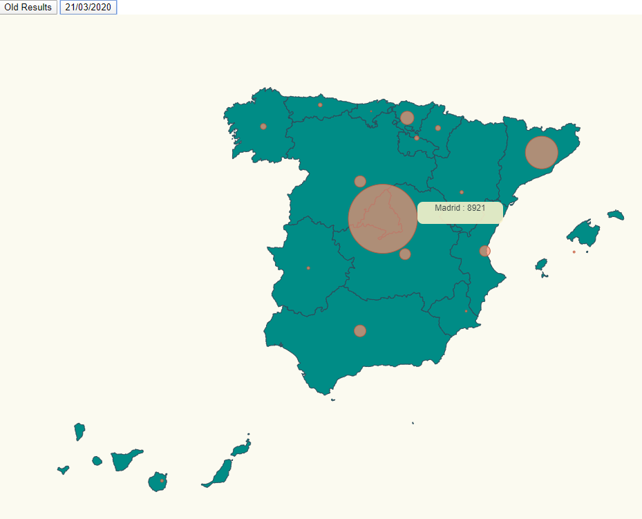

# Spain COVID 19 
#### Infected cases represented by circles

In this example a Spain map is printed showing different sets of coronavirus data.    



# Installation

- Execute _npm install_

```bash
npm install
```

# Run

- This project includes `parcel` dev-module. Therefore, to run the app just need to execute _npm start_. 

```bash
npm start
```

# Code Annotations

Typing communities
```typescript
export interface LongLatCommunity
{
    name: string,
    long: number,
    lat: number
}
```
Adding the animation
```typescript
svg.selectAll<HTMLDivElement, LongLatCommunity>("circle")
    .transition().duration(500)
    .attr("r", d => calculateRadiusBasedOnAffectedCases(d.name, data))
    .on("mouseover", function(d) {
      mouseOver(d, data);
    })
    .on("mouseout", function(d, i) {
      mouseOut(this);
});
```

# Acknowledgements

- Spain topojson info: <br>
https://github.com/deldersveld/topojson/blob/master/countries/spain/spain-comunidad-with-canary-islands.json
- Lemoncode / d3js-typescript-examples <br>
https://github.com/Lemoncode/d3js-typescript-examples/tree/master/02-maps/02-pin-location-scale