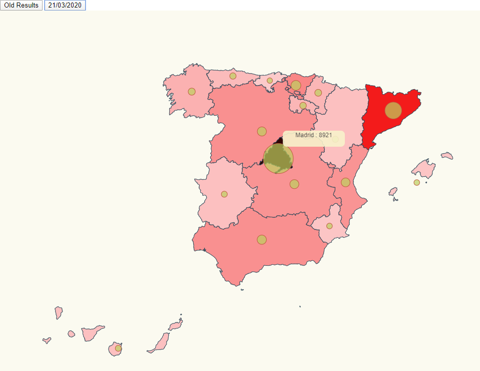

# Spain COVID 19 
#### Infected cases represented by circles and colors

In this example a Spain map is printed showing different sets of coronavirus data.    



# Installation

- Execute _npm install_

```bash
npm install
```

# Run

- This project includes `parcel` dev-module. Therefore, to run the app just need to execute _npm start_. 

```bash
npm start
```

# Code Annotations

Typing communities
```typescript
export interface LongLatCommunity
{
    name: string,
    long: number,
    lat: number
}
```
Adding the animation
```typescript
svg.selectAll<HTMLDivElement, LongLatCommunity>("circle")
    .transition().duration(500)
    .attr("r", d => calculateRadiusBasedOnAffectedCases(d.name, data))
    .on("mouseover", function(d) {
      mouseOver(d, data);
    })
    .on("mouseout", function(d, i) {
      mouseOut(this);
});
```
Mapping community names
```typescript
export const mapping = {
    "Andalucía": "Andalucía",
    "Aragón": "Aragón",
    "Cantabria": "Cantabria",
    "Castilla y León": "Castilla y León",
    "Castilla-La Mancha": "Castilla La Mancha",
    "Cataluña": "Cataluña",
    "Ceuta y Melilla": "Ceuta y Melilla",
    "Comunidad de Madrid": "Madrid",
    "Comunidad Foral de Navarra": "Navarra",
    "Comunidad Valenciana": "Valencia",
    "Extremadura": "Extremadura",
    "Galicia": "Galicia",
    "Islas Baleares": "Islas Baleares",
    "Islas Canarias": "Islas Canarias",
    "La Rioja": "La Rioja",
    "País Vasco": "País Vasco",
    "Principado de Asturias": "Asturias",
    "Región de Murcia": "Murcia"
}
```
Changing community color
```typescript
svg
    .selectAll("path")
    .transition().duration(500)
    .attr("fill", (d) => getColorByFeatureCommunity(d, data));
```
Calculating the color
```typescript
const getColorByFeatureCommunity = (d, data) => {
    const color = getColor(mapCommunity(d["properties"]["NAME_1"]), data);
    return `hsla(360,90%,${color}%,1)`;
};
```

# Acknowledgements

- Spain topojson info: <br>
https://github.com/deldersveld/topojson/blob/master/countries/spain/spain-comunidad-with-canary-islands.json
- Lemoncode / d3js-typescript-examples <br>
https://github.com/Lemoncode/d3js-typescript-examples/tree/master/02-maps/02-pin-location-scale