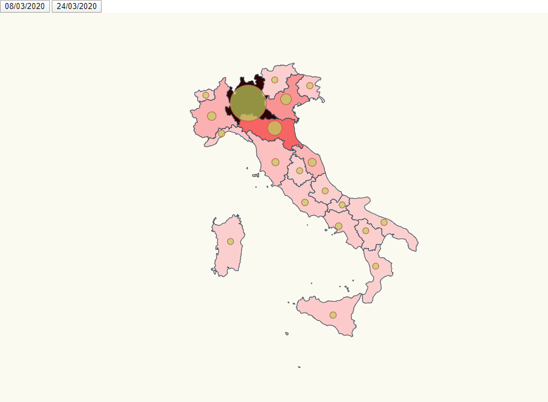

# Italy COVID 19 
#### Infected cases represented by circles and colors

In this example a Italy map is printed showing different sets of coronavirus data.    



# Installation

- Execute _npm install_

```bash
npm install
```

# Run

- This project includes `parcel` dev-module. Therefore, to run the app just need to execute _npm start_. 

```bash
npm start
```

# Acknowledgements

- Italy topojson info: <br>
https://github.com/deldersveld/topojson/blob/master/countries/italy/italy-regions.json
- Lemoncode / d3js-typescript-examples <br>
https://github.com/Lemoncode/d3js-typescript-examples/tree/master/02-maps/02-pin-location-scale